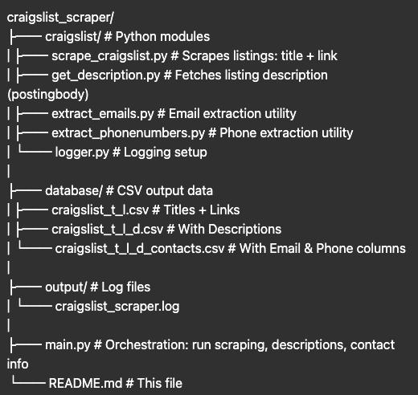

# Craigslist Scraper

Python-based scraper to create a database of listings from Craigslist.  
Extracts titles, links, descriptions, email addresses, and phone numbers; saves everything to structured CSV files.

---

## Table of Contents

- [Folder Structure](#folder-structure)
- [Installation](#installation)
- [How to Run](#how-to-run)
- [HTTP Request Utility](#http-request-utility)
- [Logging](#logging)
- [To Do](#to-do)

## Features

- Headless browsing: uses a shared requests.Session() with randomized user-agent headers  
- Eliminate duplicates by title  
- Normalize and extract:
  - Emails (including obfuscated formats like `name (at) domain dot com`)
  - Phone numbers (U.S. formats, strip leading `+1` if present)
- Centralized logging setup via **`logger.py`**  
- Output CSVs saved under `database/` folder

---

## Folder Structure

<!-- craigslist_scraper/
│
├── craigslist/ ← Python modules
│ ├── scrape_craigslist.py ← Scrapes listings: title + link
│ ├── get_description.py ← Fetches listing description (postingbody)
│ ├── extract_emails.py ← Email extraction utility
│ ├── extract_phonenumbers.py ← Phone extraction utility
│ └── logger.py ← Logging setup
│
├── database/ ← CSV output data
│ ├── craigslist_t_l.csv ← Titles + Links
│ ├── craigslist_t_l_d.csv ← With Descriptions
│ └── craigslist_t_l_d_contacts.csv ← With Email & Phone columns
│
├── output/ ← Log files
│ └── craigslist_scraper.log
│
├── main.py ← Orchestration: run scraping, descriptions, contact info
├── requirements.txt ← Python dependencies
└── README.md ← This file -->

## Installation
- Clone the repository 
```
git clone https://github.com/olga-bessonova/craigslist_scraper.git
cd craigslist_scraper
```
- Create and activate a virtual env
```
python3 -m venv venv
source venv/bin/activate
```
- Run the full pipeline
```
python main.py
```

This runs:

scrape_craigslist() generates craigslist_t_l.csv
get_description() generates craigslist_t_l_d.csv
get_contact_info() final craigslist_t_l_d_contacts.csv

# Logging
- Logging handled centrally via craigslist/logger.py and doubled in the terminal


## HTTP Request Utility
- Session management: Uses a shared requests.
- Session() with randomized user-agent headers
- User-agent randomization: Pulls from a rotating list of user agents to simulate real browser traffic
- Custom headers:	sends realistic headers like Accept, Connection, etc.
- Supports SIGINT (Ctrl+C) to stop scraping mid-run cleanly
- Retry logic: retries failed HTTP requests with exponential backoff + delay
- Randomized delays: mimics human browsing behavior between requests (e.g., 2–5 seconds)
- Timeouts: each request has a configurable timeout (default: 30s)

### Core Functions
- create_session() returns a requests.Session with randomized headers
- fetch_with_retry(...) fetches a URL with retries and backoff
- random_delay(...) sleep helper that introduces jitter between requests
- delay(ms) synchronous millisecond-level sleep
- get_random_user_agent() selects a random user-agent string
- STOP_REQUESTED a global flag toggled by Ctrl+C to safely exit

